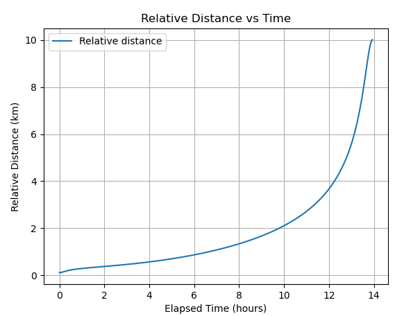

# Lunar orbit separation

Hello iSpace!

In this project, I have tried to study the separation between two satellite in lunar orbit in order for them to reach a separation of 10km after one revolution.
The initial orbit is defined with hp=100km and ha=10000km around the Moon.

## Table of Contents

- [Installation](#installation)
- [Presentation](#presentation)
- [Code structure](#code)
- [Results](#results)
- [Additional questions](#additional)

## Installation

This project makes use of the open-source astrodynamics library Orekit, python wrapper version. 
The Gitlab project is available [here](https://gitlab.orekit.org/orekit-labs/python-wrapper) .
And some instructions for installation are presented in their [wiki](https://gitlab.orekit.org/orekit-labs/python-wrapper/-/wikis/installation).

Most notably, the orekit dependency is available as a conda package to be installed:
```
conda install -c conda-forge orekit
```

Other dependencies can be installed with pip:
```
pip install -r requirements.txt
```

## Presentation
The thought-process for this problem is presented in the main.py script with comments alongside the code.
It mainly consists in the following steps:
- Setting up the problem with the initial orbit
- Using a simple phase difference to reach 10km separation after one revolution
- Computing the required deltaV required for this separation at periapsis
- Comparing with an apoapsis situation
- Checking that an impulsive burn assumption is acceptable
- Making use of a full-on numerical propagation with a simplified model in order to numerically verify our first guess
- Producing some outputs and graphs to show the results

## Code structure
The main script calls from functions and classes ordered in their respective packages. 
Note that aside the main scripts in which I have to explain the above-mentioned steps, there are almost no comments in the code itself.
This is to ensure that the code itself is readable enough by a human eye, and to improve maintenance since comments are rarely properly maintained.

The tests are in a separate packages. Unfortunately, the Orekit Python wrapper testing is very machine-dependent since it tries to setup a JVM.
So I have written down all tests as they should be executed even though I had trouble finding a correct Windows environment.

## Results
In case there is any trouble installing the required dependencies and running the script, here is the main console output I have printed out:
```
Main script starting

Initializing Orekit context...

Initial orbit parameters are:
	 - Initial epoch =  2025-01-23T00:00:00.000Z
	 - Semi major axis (km) =  6787.4
	 - Eccentricity =  0.7292925125968707
	 - Inclination (deg) =  90.0
	 - Argument of Periapsis (deg) =  0.0
	 - Right Ascension of Ascending Node (deg) =  0.0
	 - True Anomaly (deg) =  0.0

Initial keplerian period is:  50177.953020299145  s

Initial orbit velocity at periapsis =  2148.0998683268704  m/s
Initial orbit velocity at apoapsis =  336.2685686833362  m/s

Target semi-major axis =  6787.819795772661  km
Target deltaV at periapsis =  0.010398315379006817  m/s
Target deltaV at apoapsis =  0.06641854258100466  m/s

Burn duration =  0.5199088345887423  s
Burn duration represents   0.0010361300198483917  % of total revolution period

Propagating primary and secondary spacecrafts...

Propagation duration =  50177.953020299145  s
Post-processing...

Displaying relative distance vs time plot...
Final achieved relative distance =  10.012347195388365 km

Displaying 3D trajectories plot...

All done!
```
And the relative distance vs Time graph representing the separation after the initial perigee deltaV:



## Additional questions
There were some additional questions:

- *Given the latitude/longitude of the landing site, what are the conditions imposed on the orbit when preparing to land?*

Once the coordinates of the landing sites are known. The landing sequence constrains the initial orbit prior to descent.

This orbit must comply with the following elements.

The ground track must cover the landing site coordinates meaning that both inclination and RAAN must be suitable with respect to landing site latitude and longitude.
For inclination, it means that it should at least be equal to the landing site's latitude, meaning that polar orbits might be useful as they cover all possible latitudes (one of the reason it was used in the previous separation problem)
For RAAN, it should be selected so that the "fictive" periapsis, meaning the impact coordinates with surface, are phased at the proper longitude (depending on inclination).
If the orbit undergoes significant RAAN drift from orbital perturbations, it might be useful to aim for a RAAN value allowing parking operations before landing sequence. And then take into acount the secular drift to phase with the appropriate landing longitude.

Of course the periapsis should be above or before the landing sites coordinates in along-track direction. Since the powered descent aims to reducing this periapsis to 0, it would be preferable to phase the AoP accordingly.

Initial semi-major axis also has an importance since all orbital velocities must be "killed" in order to safely touch down on the surface.
That is why preferred initial orbits prior to landing are often low lunar orbits (typically 100km of altitude)

Additionally, the initial spacecraft anomaly might also be important depending on the size of the semi-major axis, and then its revolution period.
If the spacecraft has to wait "too long" before the landing sequence because it does not have the correct in orbit position, some drifts might occur on the orbital plane if not taken into account.

Lastly, when considering phasing subjects, it is also important to consider operational aspects such as visibility capabilities from Earth or relay satellites,
eclipses, local time for the ground operators etc.


- *About the CR3BP: what is the most efficient method to move from a L1 Halo to a L2 Halo orbit?*

One of the main tradeoffs in Flight Dynamics, especially within the restricted 3-body problem, is to find the right balance between deltaV and time of flight, or transfer duration.
For unmanned missions, the largest constraint is often on the available propellant mass with respect to payload mass/launcher capability.
So let's assume here that efficiency here is about using the least amount of propellant, or deltaV, to achieve this transfer but at the cost of transfer duration.
Of course, the time of flight duration weighting would also be useful in other types of missions, like the ones carrying astronauts and life support systems.

L1 and L2 halo orbits exist within the CR3BP around their respective Lagrange points in the rotating frame.
Both "families" might be interesting for several kinds of missions. They also both have manifolds structure available to reach or depart the quasi-periodic orbits in their respective families.
Since these manifolds exist in both a stable and unstable variety, respectively meaning that a spacecraft following these manifolds would converge to/depart from
the associated halo orbit, it is then possible to find some points in space where they cross each other so that a spacecraft would have almost no deltaV to perform to pass from one to the other.
In this example, it would mean performing these steps:
1) Start from an initial L1 halo orbit
2) Define the **unstable** manifold that would allow to asymptotically depart from this L1 halo orbit
3) Define the **stable** manifold from the targeted L2 halo orbit
4) Find a connection point between these two manifolds such that a spacecraft would have little to no deltaV to perform to transfer
5) Coast until reaching the L2 halo with correction burns along the way if needed

Since the CR3BP is a simplified model, it would then be a good idea to optimize this initial trajectory with full-force numerical integrator
and refine it with differential corrections to smooth out any errors, or plan/size correction maneuvers.

